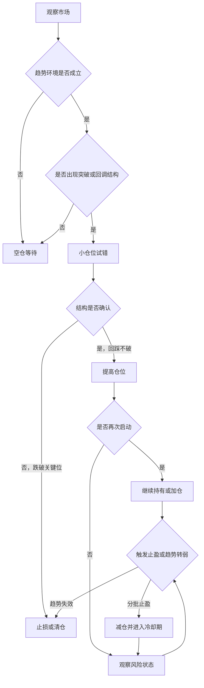

# TrendWaveTracker

面向 TradingView 的 Pine Script 趋势交易系统实验仓库。项目目前以“趋势回调 + 均线突破 + ATR 跟踪止损”为核心，尝试把主观交易中的趋势判断、结构确认、仓位推进和退出纪律，逐步沉淀为可回测、可复盘、可迭代的脚本。

> 重要说明：本项目仅用于 Pine Script 学习、交易系统建模和历史回测研究，不构成任何投资建议。脚本可能存在逻辑缺陷、参数过拟合、回测偏差和实盘不可执行的问题，请勿直接用于真实交易。

## 项目主旨

这个项目不是为了寻找“神奇买点”，而是为了把一套趋势跟随思路写成可以验证的规则：

- 先判断方向，再寻找结构，而不是只盯着单根 K 线。
- 用小仓位试错，用确认后的结构逐步提高仓位。
- 在趋势变弱、放量破位或触发止盈条件时退出或减仓。
- 通过脚本把交易动作拆成可复盘的信号：入场、加仓、减仓、清仓、冷却期。

这也对应博客文章《[短线交易的核心：用仓位去“跟随趋势”，而不是“预测涨跌”](https://blog.tangly1024.com/article/trend-following-position-system-china-stocks)》中的核心观点：交易系统的重点不是预测明天涨跌，而是在趋势逐步被市场确认时，把仓位推到合适的位置；在结构失效时，尽早承认错误。

## 当前脚本

| 脚本 | 类型 | 核心逻辑 | 适合研究的问题 |
| --- | --- | --- | --- |
| `strategies/MABreakout_ScalingExit.pine` | 均线突破策略 | 价格上穿快/慢均线入场，触及布林上轨分批减仓，跌破清仓均线退出 | 右侧突破信号、冷却期减仓、均线类型切换 |
| `strategies/TrendPullback_DynamicScale.pine` | 趋势回调策略 | EMA 趋势成立后，价格回调到短周期均线附近入场，布林上轨分批减仓，趋势反转清仓 | 趋势中的回调入场、动态减仓 |
| `strategies/TrendPullback_With60EMA.pine` | 趋势回调增强版 | 在趋势回调策略基础上加入 60EMA 过滤，避免在更大级别弱势中做多 | 多周期趋势过滤、空头环境规避 |
| `strategies/ATR.pine` | ATR 趋势测试 | 使用 ATR 跟踪止损判断方向，结合 10/20 均线与长期均线寻找多级买点 | 趋势跟踪止损、加仓触发点 |
| `strategies/TrendPullback_WithATR.pine` | 组合实验版 | 将趋势回调、60EMA 过滤、布林减仓和 ATR 多级买入逻辑组合到一个脚本中 | 多模块组合、信号冲突与风险控制 |

## 交易理念映射

博客中的交易系统可以拆成四个层级，本仓库后续会围绕这四层继续迭代：

| 理念层级 | 人工交易中的含义 | 当前脚本状态 | 后续方向 |
| --- | --- | --- | --- |
| 板块节奏 | 先选强势方向，避免孤立地看个股 | 暂未实现 | 接入板块指数、行业 ETF 或自定义强弱过滤 |
| 结构突破 | 突破平台/前高后等待确认 | 已有均线突破雏形 | 增加前高、箱体、平台突破识别 |
| 回踩确认 | 突破后缩量回踩不破，再提高确定性 | 已有均线回调雏形 | 增加突破位回踩、缩量确认、二次启动 |
| 仓位推进 | 20% 试仓、50% 确认、70% 吃趋势、90% 只给极强主线 | 目前多为固定比例或简单加仓 | 重构为分档仓位状态机 |

## 计划中的系统形态

目标不是把所有条件堆进一个复杂脚本，而是逐步形成清晰的模块：

1. 趋势过滤模块：判断大盘、板块和个股是否处于可做多环境。
2. 结构识别模块：识别平台突破、前高突破、回踩不破、再次启动。
3. 仓位状态机：按照 20% -> 50% -> 70% -> 90% 的思路管理持仓推进。
4. 风控退出模块：识别假突破、放量下跌、跌破关键位、趋势反转。
5. 复盘面板：在图表上显示当前阶段、仓位档位、最近一次信号和风险状态。

## 使用方式

1. 打开 TradingView。
2. 新建 Pine Script 策略。
3. 复制 `strategies/` 目录中任意 `.pine` 文件内容。
4. 保存并添加到图表。
5. 先在历史数据中观察信号是否符合预期，再调整参数。

建议先使用默认参数做观察，不要一开始就追求最高收益率。更重要的是看信号是否符合策略逻辑：入场是否发生在趋势环境中，减仓是否过早或过晚，清仓是否能避免大级别回撤。

## 参数调试建议

- 均线周期：用于控制趋势判断的灵敏度。周期越短，信号越多但噪声越大。
- 最小斜率：用于过滤弱趋势。阈值越高，入场越少但趋势质量可能更好。
- 回调幅度：用于定义“接近回调均线”的宽松程度。
- 布林周期与倍数：用于控制分批止盈触发频率。
- 减仓比例与冷却期：用于避免在强趋势中过快卖光，也避免连续高位重复减仓。
- ATR 倍数：用于控制跟踪止损线的宽度，影响趋势方向切换速度。

## 当前限制

- Pine Script 难以完整表达 A 股板块强弱、市场情绪和成交额联动，当前脚本主要验证个股技术结构。
- 回测结果没有充分纳入滑点、流动性、涨跌停、停牌、实际成交限制等因素。
- 当前脚本中的仓位推进还比较粗糙，尚未严格实现博客中的 20%/50%/70%/90% 分档体系。
- 部分脚本仍是实验版本，信号可能重复、冲突或不符合实盘交易习惯。
- 历史回测不代表未来表现，参数也可能只适配某段行情。

## Roadmap

- [ ] 修正脚本中的中文编码与命名，统一变量、注释和参数分组。
- [ ] 抽象一版“结构突破 -> 回踩确认 -> 再次启动”的标准策略。
- [ ] 实现分档仓位状态机：试仓、确认仓、趋势仓、主线增强仓。
- [ ] 增加假突破识别：跌破突破位、放量下跌、回踩失败。
- [ ] 增加板块/大盘过滤方案，至少支持手动选择参考指数。
- [ ] 增加更清晰的图表面板，展示当前交易阶段和风控状态。
- [ ] 整理回测模板，记录不同市场、周期和参数组合下的表现。

## 可视化效果

## 策略流程

## 版本记录

- `v2.x`：加入状态面板、布林上轨分批减仓、均线类型切换、60EMA 过滤和 ATR 趋势模块。
- `v1.x`：完成均线突破、趋势回调和基础仓位管理实验。

## 免责声明

本仓库代码和文档只表达交易系统建模思路，不保证收益，不承诺胜率，不提供买卖建议。任何真实交易都需要自行承担风险，并结合自己的资金规模、交易经验、市场限制和心理承受能力独立判断。
